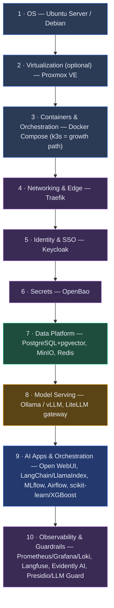
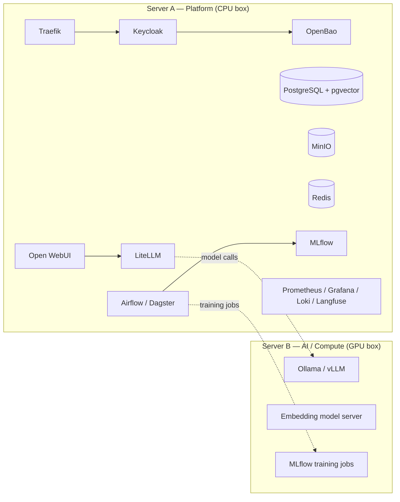

# Open Source AI Stack for SMBs

A reference architecture for a **fully open source AI software stack** that runs on **1–2 servers** — everything from the operating system up through end-user-facing analytics/AI applications: a ChatGPT-style RAG chat interface, classification/prediction models (e.g. churn scoring) with API endpoints, SSO, and security/observability. Every component ships under an OSI-approved (or explicitly noted) open source license, and the whole thing runs fully on-prem with no required cloud dependency.

> Built for small/medium businesses that want AI capability without vendor lock-in, per-seat/per-token cloud costs, or data leaving the building.

## Contents

- [`docs/ARCHITECTURE.md`](docs/ARCHITECTURE.md) — the full write-up: design principles, layer-by-layer component breakdown, 1-server and 2-server topologies, two worked examples (RAG chatbot; churn classifier with a scoring API), a licensing reference table, and a phased rollout plan.
- [`docs/architecture-diagram.html`](docs/architecture-diagram.html) — a standalone interactive diagram (open directly in a browser, or serve via GitHub Pages — see below) showing the layer stack and 2-server topology.
- [`docs/index.html`](docs/index.html) — a small landing page (used as the GitHub Pages homepage) linking out to the diagram.

## At a glance

### Recommended 2-server split

## Two example use cases covered in the guide

1. **"ChatGPT for the company"** — a RAG chat assistant over internal documents, with per-user access control enforced at retrieval time via SSO group membership.
2. **A custom classifier with a scoring API** — e.g. a 30-day churn model: train with scikit-learn/XGBoost, track/register with MLflow, serve behind a FastAPI endpoint that other internal systems `POST` customer records to for real-time or batch scoring, with drift monitoring via Evidently AI.

See [`docs/ARCHITECTURE.md`](docs/ARCHITECTURE.md) for the full detail on both, including a sample FastAPI scoring-endpoint snippet.

## License

The documentation in this repository is provided under [CC BY 4.0](https://creativecommons.org/licenses/by/4.0/) unless you replace this section with your own license before publishing. Every software component referenced in the architecture carries its own license — see the licensing table in `docs/ARCHITECTURE.md` §6.
